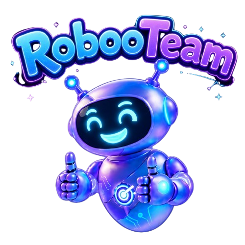
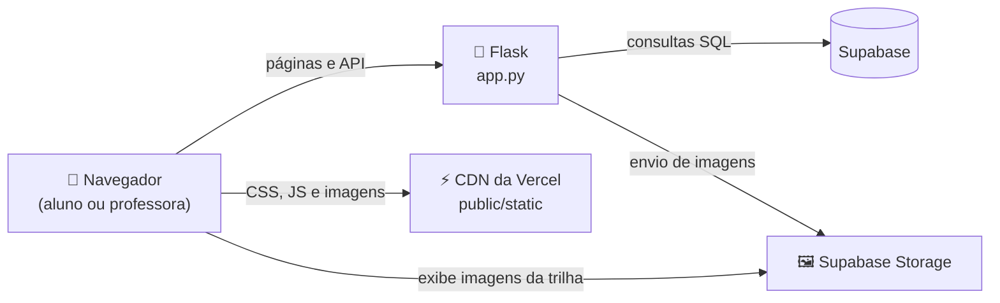

<div align="center">



# RobooTeam

**Robótica, programação e inteligência artificial aprendidas na prática, com trilhas, quizzes e minijogos.**


</div>

---

## 📑 Sumário

- [Sobre o projeto](#-sobre-o-projeto)
- [Funcionalidades](#-funcionalidades)
- [Tecnologias](#-tecnologias)
- [Como o sistema funciona](#-como-o-sistema-funciona)
- [Como executar no seu computador](#-como-executar-no-seu-computador)
- [Primeiro acesso](#-primeiro-acesso)
- [Trocar a senha da professora](#-trocar-a-senha-da-professora)
- [Banco de dados](#-banco-de-dados)
- [Segurança](#-segurança)
- [Estrutura dos arquivos](#-estrutura-dos-arquivos)

---

## 🤖 Sobre o projeto

A **RobooTeam** é uma plataforma educacional que apresenta a robótica, a programação e a inteligência artificial a crianças e adolescentes de um jeito leve e divertido. Em vez de aulas só teóricas, o aluno avança por uma **trilha de aprendizado** com leituras curtas, **quizzes** e **minijogos**, programa um robô com **blocos** e participa de **partidas em equipe** na Arena.

A professora acompanha tudo por um **painel próprio**: vê o progresso de cada aluno, monta a trilha da turma do jeito que quiser e cria partidas na Arena.

O objetivo é estimular a curiosidade, o raciocínio lógico e a colaboração entre os alunos.

---

## ✨ Funcionalidades

### 👦 Área do aluno

- **Cadastro e login** com e-mail e senha.
- **Trilha da IA**: etapas que vão sendo liberadas uma de cada vez. Para concluir uma etapa, o aluno lê o conteúdo, acerta todas as perguntas do quiz e completa o minijogo.
- **Pontos e níveis**: cada etapa concluída vale 100 pontos, e o nível sobe a cada duas etapas.
- **Entrar na sala** da professora com um código, para ver a trilha personalizada da turma.
- **Oficina do Robô**: o aluno personaliza o próprio robô (pose, cor e acessório).

### 👩‍🏫 Painel da professora

- **Resumo da turma**: total de alunos, média de progresso e situação de cada aluno.
- **Código da sala** (`RBT-XXXX`), válido por 24 horas, para os alunos entrarem na turma.
- **Editor da trilha**: criar, editar, reordenar e remover etapas, escolher perguntas e minijogos, anexar imagens (até 4 MB) e restaurar a trilha original quando quiser.
- **Arena RobooTeam**: criar partidas, desenhar ou sortear o mapa, iniciar e encerrar o jogo e responder aos pedidos de ajuda dos alunos.

### 🗺️ Trilha padrão: "Conhecendo a inteligência artificial"

| Etapa | Período | Tema | Minijogo |
| :---: | --- | --- | --- |
| 1 | 1940 a 1959 | O começo dos robôs pensantes | Jogo da memória |
| 2 | 1960 a 1999 | Robôs de regras e xadrez | Labirinto do robô |
| 3 | 2000 a 2019 | Computadores que aprendem | Caça-palavras |
| 4 | 2020 até hoje | Robôs escritores e artistas | Jogo da memória |
| 5 | O futuro da IA | Os guardiões do futuro | Jogo da cobrinha |

Cada etapa tem 4 perguntas de quiz, com explicação da resposta certa.

### 🎮 Minijogos disponíveis

| Minijogo | Como funciona |
| --- | --- |
| 🧠 Jogo da memória | Encontrar os pares de termo e significado |
| 🧭 Labirinto | Guiar o robô até a saída (1 a 3 fases) |
| 🔤 Caça-palavras | Achar as palavras escondidas na grade |
| 🐍 Cobrinha | Pegar a quantidade de bolinhas da meta |
| 🧩 Ligar blocos | Arrastar cada bloco até a explicação correta |

### 🧱 Missão Robô: programação em blocos

Jogo com **5 fases** em um mapa 6×6. O aluno monta uma sequência de comandos (**avançar**, **virar à esquerda** e **virar à direita**) para levar o robô até a bandeira sem bater nas paredes e sem passar do limite de blocos. Quanto menos blocos usar, mais pontos ganha. O jogo é liberado depois que o aluno entra em uma sala.

### 🏆 Arena RobooTeam

Partidas em sala criadas pela professora:

1. A professora desenha (ou sorteia) um mapa de 6×6, 8×8 ou 10×10 e recebe um código `ARN-XXXX`.
2. Os alunos digitam o código no campo **Entrar na sala** e escolhem uma equipe (até 4 jogadores por equipe).
3. Cada aluno programa o robô com blocos (**avançar**, **virar** e **repetir**).
4. O tempo de cada jogador é somado no **ranking da equipe**.
5. Se travar, o aluno pode pedir uma **dica**, pedir ajuda a um **colega de equipe** ou chamar a **professora**.

---

## 🛠️ Tecnologias

<p align="center">
  
</p>

| Tecnologia | Para que é usada |
| --- | --- |
| **Python 3.12** | Linguagem do servidor |
| **Flask** | Páginas, rotas e API do sistema |
| **Jinja2** | Montagem das páginas HTML no servidor |
| **HTML, CSS e JavaScript** | Interface, animações e minijogos (sem frameworks) |
| **PostgreSQL (Supabase)** | Banco de dados: usuários, progresso, trilhas e arenas |
| **Supabase Storage** | Armazenamento das imagens enviadas para as trilhas |
| **psycopg 3** | Conexão do Python com o PostgreSQL |
| **Werkzeug** | Criptografia (hash) das senhas |
| **ItsDangerous** | Tokens de login assinados |
| **Vercel** | Hospedagem do site (região São Paulo) |
| **Git e GitHub** | Controle de versão |

---

## 🔄 Como o sistema funciona



- O **navegador** carrega as páginas pelo Flask. Os arquivos fixos (CSS, JavaScript e imagens) vêm direto da CDN.
- O **Flask** é o único que conversa com o banco. Ele confere o login, valida as respostas e salva o progresso.
- As **imagens da trilha** são enviadas pelo servidor ao Supabase Storage, e os alunos as abrem pelo link público.

---

## 💻 Como executar no seu computador

### O que você precisa ter instalado

| Programa | Onde baixar |
| --- | --- |
| Python 3.12 (ou mais novo) | [python.org/downloads](https://www.python.org/downloads/). Na instalação, marque **"Add Python to PATH"** |
| Git | [git-scm.com](https://git-scm.com/) |
| Conta no Supabase (gratuita) | [supabase.com](https://supabase.com/) |

> Os comandos abaixo são para o **PowerShell** do Windows. Abra o terminal **dentro da pasta do projeto**.

### Passo 1: baixar o projeto

```powershell
git clone https://github.com/ViniciusMarioziOliveira/TCC_RobooTeam.git
cd TCC_RobooTeam
```

### Passo 2: criar o banco de dados no Supabase

1. Entre em [supabase.com/dashboard](https://supabase.com/dashboard) e clique em **New project**.
2. Escolha a região **South America (São Paulo)** e crie uma senha para o banco. **Guarde essa senha.**
3. No menu lateral, abra o **SQL Editor**.
4. Copie todo o conteúdo do arquivo `supabase/schema.sql`, cole no editor e clique em **Run**. Isso cria as tabelas.
5. Faça o mesmo com o arquivo `supabase/professora_beatriz.sql`. Isso cria o login da professora.

### Passo 3: criar o ambiente virtual do Python

O ambiente virtual é uma pasta (`.venv`) que guarda as bibliotecas só deste projeto.

```powershell
py -m venv .venv
```

### Passo 4: instalar as bibliotecas

```powershell
.\.venv\Scripts\python.exe -m pip install -r requirements.txt
```

### Passo 5: configurar o arquivo `.env`

O `.env` guarda as senhas e chaves do projeto. Ele **nunca** vai para o GitHub.

1. Faça uma cópia do arquivo de exemplo:

   ```powershell
   Copy-Item .env.example .env
   ```

2. Abra o `.env` e preencha cada linha:

   | Variável | Onde encontrar |
   | --- | --- |
   | `SECRET_KEY` | Uma chave aleatória. Gere com o comando abaixo da tabela |
   | `DATABASE_URL` | Supabase → botão **Connect** → **Transaction pooler** (porta 6543). Troque `[YOUR-PASSWORD]` pela senha do Passo 2 |
   | `SUPABASE_URL` | Supabase → **Project Settings → API Keys** → URL do projeto |
   | `SUPABASE_SECRET_KEY` | Supabase → **Project Settings → API Keys** → **secret key** (começa com `sb_secret_`) |

   Para gerar a `SECRET_KEY`:

   ```powershell
   .\.venv\Scripts\python.exe -c "import secrets; print(secrets.token_hex(32))"
   ```

### Passo 6: iniciar o sistema

```powershell
.\.venv\Scripts\python.exe app.py
```

Quando aparecer `Running on http://127.0.0.1:5000`, o sistema está no ar.

### Passo 7: abrir no navegador

Acesse **http://127.0.0.1:5000**. Para desligar o servidor, volte ao terminal e aperte `Ctrl + C`.

> **Algo deu errado?**
> - *"Não foi possível acessar o banco de dados"*: confira a `DATABASE_URL` no `.env`. Ela deve ser a do **Transaction pooler** (porta 6543), com a senha correta.
> - *"O envio de imagens ainda não foi configurado"*: faltou preencher `SUPABASE_URL` ou `SUPABASE_SECRET_KEY`.
> - *`py` não é reconhecido*: reinstale o Python marcando **"Add Python to PATH"**.

---

## 🚀 Primeiro acesso

### Como professora

- **E-mail:** `beatriz@robooteam.com`
- **Senha:** entregue separadamente pela equipe (não fica no repositório).

No painel, clique em **Gerar novo código** para criar o código da sala (`RBT-XXXX`). Ele vale por 24 horas.

### Como aluno

1. Na página inicial, clique em **Cadastre-se**.
2. Preencha nome (mínimo de 3 letras), e-mail e senha (mínimo de 8 caracteres).
3. Entre com o e-mail e a senha cadastrados.
4. No painel, digite o código da sala que a professora gerou.

> Alunos **sem sala** veem a trilha padrão. Alunos **com sala** veem a trilha montada pela professora.

---

## 🔑 Trocar a senha da professora

O banco guarda apenas o **hash** da senha (uma versão embaralhada), nunca a senha em si. Para trocar:

**1. No terminal**, gere o hash da nova senha (troque `NOVA_SENHA` pela senha desejada):

```powershell
.\.venv\Scripts\python.exe -c "from werkzeug.security import generate_password_hash as h; print(h('NOVA_SENHA'))"
```

Copie o resultado inteiro (começa com `scrypt:`).

**2. No Supabase**, abra o **SQL Editor** e rode, colando o hash entre as aspas simples:

```sql
update public.usuarios set senha_hash = 'COLE_O_HASH_AQUI' where perfil = 'PROFESSOR';
```

Pronto: a próxima entrada já usa a senha nova.

---

## 🗄️ Banco de dados

As tabelas são criadas pelo arquivo `supabase/schema.sql`:

| Tabela | O que guarda |
| --- | --- |
| `usuarios` | Alunos e a professora (nome, e-mail, senha em hash, sala) |
| `progresso_trilha` | Etapas da trilha concluídas por cada aluno |
| `progresso_jogo` | Fases do jogo de blocos concluídas e pontuação |
| `trilha_atividades` | Trilha personalizada pela professora |
| `arenas` | Partidas da Arena (mapa, código e situação) |
| `arena_equipes` | Equipes de cada partida |
| `arena_jogadores` | Jogadores, tempos, tentativas e pedidos de ajuda |

Também é criado o bucket público `trilha-imagens`, no Supabase Storage, para as imagens das etapas.

---

## 🔒 Segurança

- **Senhas** guardadas apenas como hash (algoritmo *scrypt*).
- **Login** por token assinado, guardado em cookie `HttpOnly` (o JavaScript da página não consegue lê-lo).
- **Um único professor**: o banco impede a criação de um segundo, e todo cadastro feito pelo site é de aluno.
- **RLS (Row Level Security)** ligado em todas as tabelas: só o servidor acessa os dados, e as chaves públicas do Supabase não leem nada.
- **Respostas conferidas no servidor**: quizzes, fases e partidas são validados pelo Flask, não pelo navegador.
- **Imagens verificadas** pelo conteúdo do arquivo (PNG, JPG, WEBP ou GIF, até 4 MB), não apenas pela extensão.
- **Chaves e senhas** ficam no `.env` (fora do GitHub) ou nas variáveis de ambiente da hospedagem.

---

## 📁 Estrutura dos arquivos

```text
TCC_RobooTeam/
├── app.py                  # Aplicação Flask: páginas e API
├── db.py                   # Conexão com o banco do Supabase
├── usuarios_store.py       # Usuários, login e progresso dos alunos
├── trilha_store.py         # Trilha personalizada da professora
├── arena_store.py          # Partidas da Arena RobooTeam
├── armazenamento.py        # Imagens da trilha no Supabase Storage
├── trilha_conteudo.py      # Conteúdo padrão da trilha e dos minijogos
├── jogo_conteudo.py        # Fases e regras do jogo de blocos
│
├── templates/              # Páginas HTML
│   ├── index.html          # Página inicial
│   ├── login.html          # Login e cadastro
│   ├── aluno.html          # Painel do aluno
│   ├── trilha_aula.html    # Conteúdo de uma etapa da trilha
│   ├── jogo_blocos.html    # Missão Robô (programação em blocos)
│   ├── arena.html          # Arena RobooTeam
│   └── professor.html      # Painel da professora
│
├── public/static/          # CSS, JavaScript e imagens
│
├── supabase/
│   ├── schema.sql              # Tabelas, segurança e bucket de imagens
│   └── professora_beatriz.sql  # Login da professora
│
├── .env.example            # Modelo das variáveis de ambiente
├── requirements.txt        # Bibliotecas Python
├── .python-version         # Versão do Python
└── vercel.json             # Configuração da hospedagem
```

---

<div align="center">

Feito com 💜 pela equipe **RobooTeam** como Trabalho de Conclusão de Curso.

</div>
